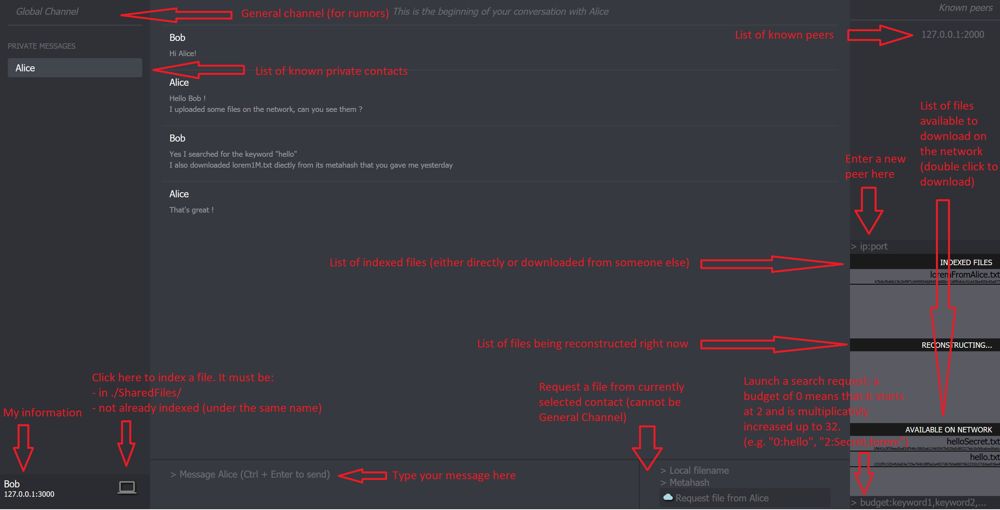

Milestone 1
=======

## How to use the GUI (webserver)

My implementation allows to use both the webserver and the CL client at the same time.  
The CL client will always be launched on the port specified in `-UIPort` (default value `8080`).   
Because the webserver is required to run on port `8080` by the handout, one must specify an `UIPort` different from `8080` for the gossiper in order to have both the CL client and the GUI (otherwise they would both use the same port).  

For example, the following commands launch a gossiper that can only use the CL client on port `8080`:  
`./Peerster -UIPort=8080 -gossipAddr=127.0.0.1:2000 -name=Alice`  
`./Peerster -gossipAddr=127.0.0.1:2000 -name=Alice`

On the other hand, the following command launches a gossiper that can use both the CL client on port `3000` and the GUI on port `8080`:  
`./Peerster -UIPort=3000 -gossipAddr=127.0.0.1:2000 -name=Alice`  

For testing purposes I also created a new flag `-GUIPort` (default value `8080`) that allows to launch the server on an arbitrary port.  
The following command launches a gossiper that can use both the CL client on port `8080` and the GUI on port `8090`:  
`./Peerster -UIPort=8080 -GUIPort=8090 -gossipAddr=127.0.0.1:2000 -name=Alice`  

Milestone 2
=======

Below is a screenshot of the GUI as well as some remarks concerning its utilization.

Some remarks:
* The webpage will not behave properly if its corresponding gossiper is stopped and then restarted. In that case one must reopen a new browser tab and relaunch the webpage on the right port.
* The webpage will not behave properly if it is refreshed while its corresponding gossiper is running.